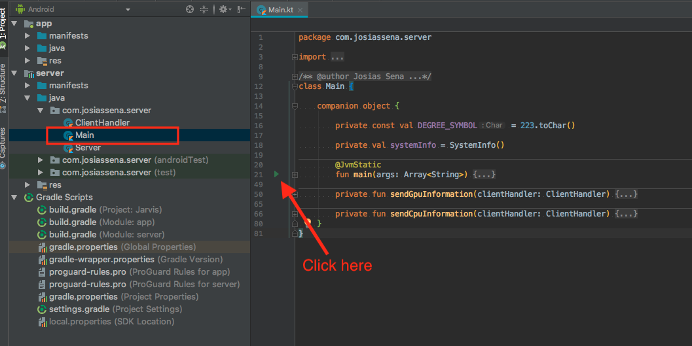
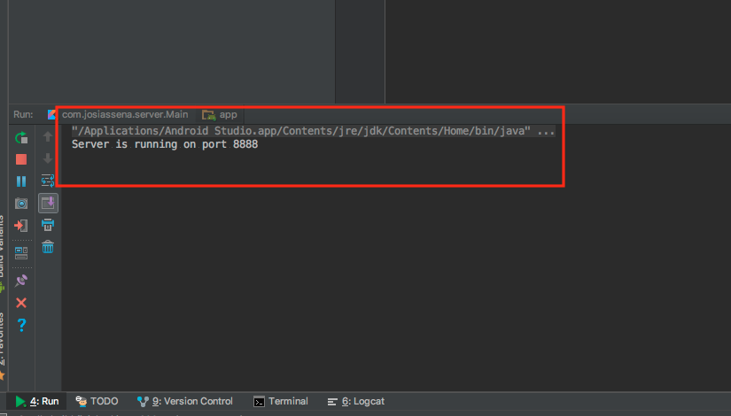

# Jarvis

### How to run

1. Run the server on the desktop machine. To do so just open the Main.kt
file on the Server module and run the Main method.

You will see a confirmation that the server is running in the run tab:

2. Then after the server is running, run the Android application.
